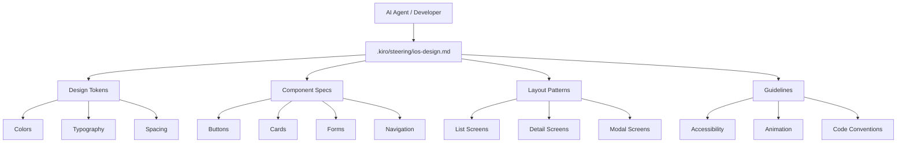

# Technical Design: iOS Design System

## Overview

**目的**: KajilisiOSアプリケーションのための包括的なデザインシステムドキュメントを作成し、AIエージェント（Claude Codeなど）が実装時にデザインの一貫性を維持できるようにする。

**対象ユーザー**: AIエージェント、開発者、デザイナーがこのデザインシステムを参照して、統一されたUI/UX実装を行う。

**影響**: 現在の最小限のiOSプロジェクト構造に、標準化されたデザインガイドラインとコンポーネント仕様を追加する。これにより、将来的な機能開発時の実装速度と品質が向上する。

### Goals

- SwiftUIベースの再利用可能なデザインシステムドキュメントを作成
- カラー、タイポグラフィ、スペーシング、コンポーネントの標準化
- AIエージェントが参照可能な明確なガイドラインと実装例の提供
- アクセシビリティとベストプラクティスの組み込み

### Non-Goals

- 実際のSwiftUIコンポーネントの実装（ドキュメント定義のみ）
- デザインツール（Figma等）との統合
- 既存のContentView.swiftの変更
- WebフロントエンドのHotwireデザインシステム

## Architecture

### High-Level Architecture

このデザインシステムは、ステアリングドキュメントとして`.kiro/steering/ios-design.md`に配置され、AI実装時に常に参照されるドキュメントです。



### Technology Alignment

本デザインシステムは既存のKajilisプロジェクト技術スタックと完全に整合します:

- **SwiftUI**: iOSネイティブUI構築のための宣言的フレームワーク
- **Swift 5.0**: iOS 26.0対応の最新言語仕様
- **Assets.xcassets**: カラー、画像、カスタムアセットの管理
- **SF Symbols**: Apple標準のアイコンシステム

**ステアリング原則への準拠**:
- **structure.md**: PascalCase命名規則、ファイル構成パターンに準拠
- **tech.md**: SwiftUIベースのネイティブ開発方針を維持
- **product.md**: モダンなスタックとドキュメント化された開発プロセスを強化

### Key Design Decisions

#### Decision 1: ドキュメントベースアプローチ

**Context**: デザインシステムの実装方法として、コード実装とドキュメント定義の2つのアプローチが存在する。

**Alternatives**:
1. **実装ファーストアプローチ**: SwiftUIコンポーネントを先に実装し、ドキュメントは後から作成
2. **デザインツール統合**: FigmaなどのデザインツールからSwiftUIコードを自動生成
3. **ドキュメントファーストアプローチ**: 詳細なMarkdownドキュメントを先に作成し、実装時に参照

**Selected Approach**: ドキュメントファーストアプローチを採用し、`.kiro/steering/ios-design.md`として定義

**Rationale**:
- AIエージェントはコード実装よりもドキュメント参照が効率的
- 仕様変更時にコード修正なしでガイドライン更新が可能
- 実装前にデザイン方針の承認とレビューが可能
- Kiro Spec-Driven Developmentの原則に沿った段階的アプローチ

**Trade-offs**:
- 獲得: 柔軟な更新性、AI参照性の向上、仕様と実装の分離
- 犠牲: 実装時にドキュメントとコードの同期を維持する必要性

#### Decision 2: セマンティックカラーシステム

**Context**: カラー定義方法として、直接色値指定とセマンティック命名の2つのアプローチが存在する。

**Alternatives**:
1. **直接色値指定**: `blue500`, `red700`のような色相ベース命名
2. **セマンティック命名**: `primary`, `success`, `error`のような用途ベース命名
3. **ハイブリッドアプローチ**: 両方のレイヤーを持つシステム

**Selected Approach**: セマンティック命名を採用し、ライト/ダークモード両対応の`Assets.xcassets` Color Setとして定義

**Rationale**:
- SwiftUIの`Color`型とシームレスに統合
- ライト/ダークモード切り替えが自動的に機能
- デザイン変更時に色値のみ更新すれば全体に反映
- 色覚異常への配慮を色値レベルで実装可能

**Trade-offs**:
- 獲得: テーマ変更の容易性、アクセシビリティ対応、意図の明確化
- 犠牲: 初期設定の複雑さ、中間色の定義が増える可能性

## Requirements Traceability

| Req | 要件概要 | 実現方法 |
|-----|---------|---------|
| 1.x | カラーシステム | `ios-design.md`のColors章でプライマリ/セカンダリ/状態カラー、ライト/ダークモード、Assets.xcassets実装方法を定義 |
| 2.x | タイポグラフィ | `ios-design.md`のTypography章でテキストスタイル階層、Dynamic Type、日本語フォント、`.font()` modifier使用例を定義 |
| 3.x | スペーシング | `ios-design.md`のSpacing章で8ptグリッドベースシステム、xxxs〜xxxl スケール、`.padding()`/`.spacing()`使用例を定義 |
| 4.x | コンポーネント | `ios-design.md`のComponents章でButton/Card/Input/Modal/Alert/Navbarの仕様、状態、命名規則、SwiftUIコード例を定義 |
| 5.x | レイアウトパターン | `ios-design.md`のLayout Patterns章でList/Detail/Form/Tab/Modal画面、Safe Area、デバイスサイズ対応、ScrollView使い分けを定義 |
| 6.x | アイコンシステム | `ios-design.md`のIcons章でSF Symbols優先方針、カスタムアイコン管理、サイズバリエーション、`.foregroundStyle()`使用例を定義 |
| 7.x | アニメーション | `ios-design.md`のAnimation章でデフォルト時間、イージング関数、`.transition()`/`.animation()`パターン、インタラクションフィードバックを定義 |
| 8.x | アクセシビリティ | `ios-design.md`のAccessibility章でVoiceOver、`.accessibilityLabel()`、WCAGコントラスト基準、Dynamic Type制約、44x44ptタップ領域を定義 |
| 9.x | 命名規則・ファイル構成 | `ios-design.md`のCode Conventions章でView/ViewModel/Model/Service接尾辞、Views/ViewModels/Components/ディレクトリ構造、`#Preview`マクロを定義 |
| 10.x | ドキュメント形式 | `ios-design.md`をMarkdown形式で作成、目次/概要/コード例/バージョン管理方針を含む、`.kiro/steering/ios-design.md`に配置 |

## Components and Interfaces

### デザインシステムドキュメント

#### ios-design.md

**Responsibility & Boundaries**
- **Primary Responsibility**: KajilisiOSアプリのデザイン標準とコンポーネント仕様を定義する包括的なドキュメント
- **Domain Boundary**: iOSアプリケーション層のUI/UXガイドライン（バックエンドAPI仕様は対象外）
- **Data Ownership**: デザイントークン、コンポーネント仕様、レイアウトパターン、コーディング規約の定義
- **Transaction Boundary**: ドキュメントの読み取りのみ（実装コードは別ファイルで管理）

**Dependencies**
- **Inbound**: AIエージェント、開発者、実装タスクが参照
- **Outbound**: なし（独立したドキュメント）
- **External**: SF Symbols（Apple提供）、SwiftUI公式ドキュメント、WCAG 2.1基準

**Contract Definition**

**ドキュメント構造仕様**:

```markdown
# Kajilis iOS Design System

## 目次
1. 概要
2. デザイン原則
3. カラーシステム
4. タイポグラフィ
5. スペーシングシステム
6. コンポーネントライブラリ
7. レイアウトパターン
8. アイコンシステム
9. アニメーション
10. アクセシビリティ
11. コーディング規約
12. バージョン管理

## セクション要件
各セクション SHALL 以下を含む:
- 概念説明
- デザイントークン定義（該当する場合）
- SwiftUI実装例（コードスニペット）
- ベストプラクティス
- 注意事項
```

**主要セクションのインターフェース**:

| セクション | 提供内容 | 出力形式 |
|-----------|---------|---------|
| カラーシステム | プライマリ/セカンダリ/状態カラー定義、ライト/ダークモード値 | Markdown表 + Assets.xcassets設定手順 |
| タイポグラフィ | テキストスタイル階層（largeTitle〜caption）、フォント設定 | Markdown表 + `.font()`コード例 |
| スペーシング | 8ptグリッドスケール（xxxs〜xxxl） | Markdown表 + `.padding()`コード例 |
| コンポーネント | Button/Card/Input等の仕様、状態、バリエーション | 仕様説明 + SwiftUIコード例 |
| レイアウトパターン | 画面タイプ別構成（List/Detail/Form/Tab/Modal） | 構成図 + コード例 |
| アイコン | SF Symbols使用方針、サイズ定義 | 使用ガイド + `.foregroundStyle()`例 |
| アニメーション | タイミング、イージング、トランジション | パラメータ表 + `.animation()`例 |
| アクセシビリティ | VoiceOver、コントラスト、タップ領域 | チェックリスト + modifier例 |
| コーディング規約 | 命名規則、ファイル構成、`#Preview` | 規約リスト + ディレクトリ構造 |

**ドキュメントバージョン管理**:

```markdown
## Version History

### v1.0.0 (2025-11-07)
- 初版リリース
- カラー/タイポグラフィ/スペーシング/コンポーネント基本定義

### 更新時のルール
- メジャー更新: 破壊的変更（コンポーネント仕様の根本的変更）
- マイナー更新: 後方互換性のある追加（新コンポーネント追加）
- パッチ更新: 軽微な修正（誤字修正、コード例の改善）
```

## Data Models

### ドキュメントデータ構造

本デザインシステムはMarkdownドキュメントであり、データベースやコードでのデータ構造は持たないが、論理的な情報構造を以下に定義する。

#### Design Tokens (デザイントークン)

デザイントークンは、デザインシステムの最小単位となる値の定義。

**Color Token**:
```swift
// 論理的な構造（ドキュメント内で定義）
struct ColorToken {
    let name: String           // 例: "primaryColor"
    let lightModeValue: Color  // 例: Color(hex: "#007AFF")
    let darkModeValue: Color   // 例: Color(hex: "#0A84FF")
    let semanticPurpose: String // 例: "主要アクション、ブランドカラー"
    let wcagContrast: Double   // 例: 4.52 (AA基準)
}
```

**Typography Token**:
```swift
struct TypographyToken {
    let styleName: String      // 例: "headline"
    let fontFamily: String     // 例: "System"
    let fontSize: CGFloat      // 例: 17.0
    let fontWeight: Font.Weight // 例: .semibold
    let lineHeight: CGFloat    // 例: 22.0
    let letterSpacing: CGFloat // 例: -0.41
}
```

**Spacing Token**:
```swift
struct SpacingToken {
    let name: String     // 例: "m"
    let value: CGFloat   // 例: 16.0
    let usage: String    // 例: "標準的なコンポーネント間余白"
}
```

#### Component Specification (コンポーネント仕様)

```swift
struct ComponentSpec {
    let name: String              // 例: "PrimaryButton"
    let purpose: String           // 例: "主要アクションのためのボタン"
    let variants: [Variant]       // 例: [.default, .destructive, .disabled]
    let properties: [Property]    // 例: title, icon, action
    let codeExample: String       // SwiftUIコード例
    let designTokens: [String]    // 使用するトークン名
}

struct Variant {
    let name: String              // 例: "destructive"
    let visualChanges: [String]   // 例: ["背景色: errorColor", "テキスト色: white"]
    let usageGuideline: String    // 例: "削除など取り消しできないアクション"
}

struct Property {
    let name: String              // 例: "title"
    let type: String              // 例: "String"
    let required: Bool            // 例: true
    let defaultValue: String?     // 例: nil
}
```

#### Layout Pattern (レイアウトパターン)

```swift
struct LayoutPattern {
    let patternName: String       // 例: "ListScreen"
    let description: String       // 例: "スクロール可能なアイテムリスト画面"
    let structure: [LayoutElement] // 画面構成要素
    let navigationStyle: String   // 例: "NavigationStack with toolbar"
    let codeTemplate: String      // SwiftUIテンプレートコード
}

struct LayoutElement {
    let component: String         // 例: "NavigationBar"
    let position: String          // 例: "top"
    let required: Bool            // 例: true
}
```

### データ整合性ルール

ドキュメント内で維持すべき整合性:

1. **トークン参照の整合性**: コンポーネント仕様内で参照するデザイントークン名は、トークン定義セクションに存在する必要がある
2. **コード例の妥当性**: 提供するSwiftUIコード例は、Swift 5.0およびiOS 26.0で動作可能である必要がある
3. **アクセシビリティ基準**: 定義するカラー/タイポグラフィ/スペーシングは、WCAG 2.1 AA基準を満たす必要がある
4. **バージョン追跡**: ドキュメント更新時は必ずバージョン番号と変更履歴を更新する必要がある

## Error Handling

### Error Strategy

デザインシステムドキュメントは実装コードではないため、ランタイムエラーは発生しないが、ドキュメント品質とAI参照時のエラーを以下のように管理する。

### Error Categories and Responses

**ドキュメント品質エラー**:
- **不整合**: トークン名の不一致 → レビュー時に検出、修正前にマージ拒否
- **不完全な仕様**: コード例の欠如 → テンプレートチェックリストで検証
- **非推奨パターン**: 古いSwiftUI構文 → 定期的な技術レビューで更新

**AI参照時のエラー**:
- **情報不足**: コンポーネント実装に必要な詳細が不足 → 「実装時に確認が必要」と明記
- **曖昧な指示**: 複数の解釈が可能 → 具体的なコード例で明確化
- **矛盾する指示**: 異なるセクションで矛盾 → バージョン管理で変更追跡、修正

**実装時の参照エラー処理**:
```swift
// AIエージェントが参照できない場合のフォールバック
// ドキュメント内に明記:
// 「本ドキュメントに記載がない場合は、Apple Human Interface Guidelines
//  およびSwiftUI公式ドキュメントを参照すること」
```

### Monitoring

**ドキュメント品質モニタリング**:
- **レビュー頻度**: 新規コンポーネント追加時、四半期ごとの定期レビュー
- **更新トリガー**: SwiftUI新機能リリース、実装中の問題発見、ユーザーフィードバック
- **品質指標**:
  - コード例の動作検証率（目標: 100%）
  - AI実装時の参照成功率（目標: 90%以上）
  - ドキュメント更新の遅延日数（目標: 新機能リリースから14日以内）

## Testing Strategy

### ドキュメント品質テスト

**構造検証テスト**:
- 必須セクションの存在確認（目次、概要、10個のメインセクション、バージョン履歴）
- 内部リンクの整合性確認（トークン名参照、コンポーネント参照）
- Markdown構文の正確性確認

**コード例検証テスト**:
- 提供するSwiftUIコードスニペットのコンパイル検証
- iOS 26.0シミュレーターでの動作確認
- Xcode Previewsでの表示確認

**アクセシビリティ基準テスト**:
- カラーコントラスト比の計算と検証（WCAG AA: 4.5:1以上）
- タップ領域サイズの確認（最小44x44pt）
- VoiceOver対応ガイドラインの妥当性確認

**AI参照可能性テスト**:
- 実際にAIエージェントにドキュメントを参照させて実装タスク実行
- 不足情報や曖昧な指示の特定
- フィードバックに基づくドキュメント改善

### レビュープロセス

**作成時レビュー**:
1. 技術レビュー: SwiftUI構文の正確性、ベストプラクティス準拠
2. デザインレビュー: UI/UX原則との整合性、アクセシビリティ基準
3. 実装レビュー: 実際にコード例を実装して動作検証

**更新時レビュー**:
1. 変更影響分析: 既存実装への影響評価
2. バージョン管理: 適切なバージョン番号の付与
3. 変更履歴記録: 何が変わったかを明確に記載

## Security Considerations

### ドキュメントセキュリティ

**アクセス制御**:
- ドキュメントはGitリポジトリで管理され、プロジェクトメンバーのみが編集可能
- Pull Requestによるレビュープロセスで変更を管理

**機密情報管理**:
- デザインシステムドキュメントには機密情報を含めない
- APIキー、認証情報、個人情報はドキュメントから除外
- カスタムアセット（ロゴ等）は著作権に配慮

**インジェクション攻撃防止**:
- コード例内で文字列補間する場合は、常にエスケープ処理を明記
- ユーザー入力を扱うコンポーネントでは、バリデーション例を含める

```swift
// ドキュメント内のコード例に含めるセキュリティベストプラクティス
struct SecureInputField: View {
    @State private var userInput: String = ""

    var body: some View {
        TextField("Input", text: $userInput)
            .textContentType(.none) // 自動入力を無効化する場合
            .autocapitalization(.none)
            .disableAutocorrection(true) // セキュアな入力の場合
    }
}
```

**バージョン管理とトレーサビリティ**:
- すべての変更をGitコミット履歴で追跡
- 変更理由をコミットメッセージに明記
- ドキュメント内のバージョン履歴と同期
